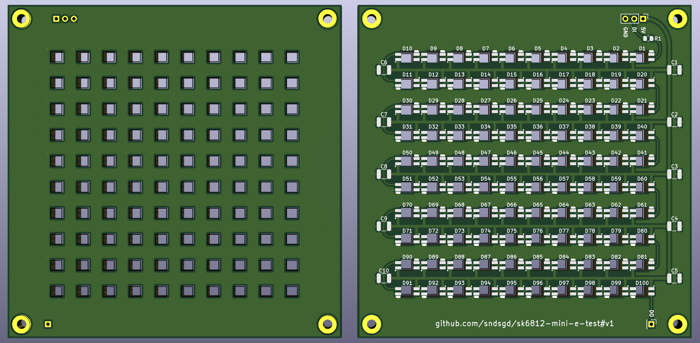

# `sk6812-mini-e-test`

I've successfully used SK6812-MINI-E LEDs in several projects recently, and I'm considering using _lots_ of them in the near future. I'll be using this little board to verify performance and power requirements before scaling to thousands of LEDs.

